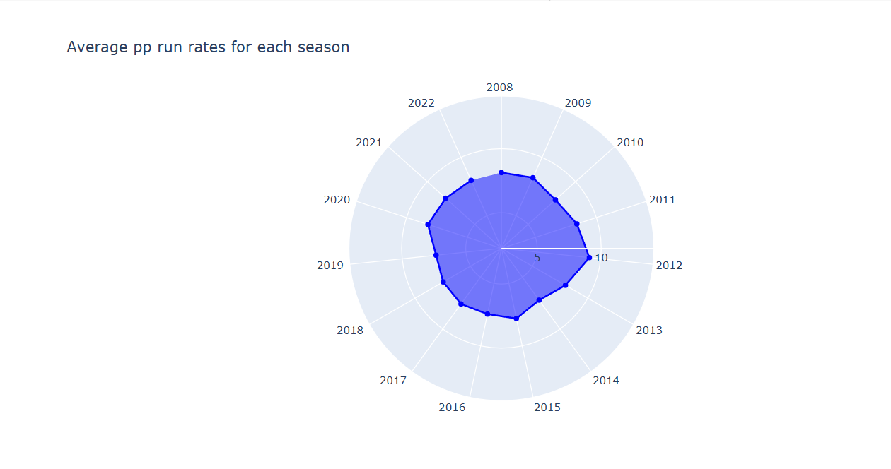
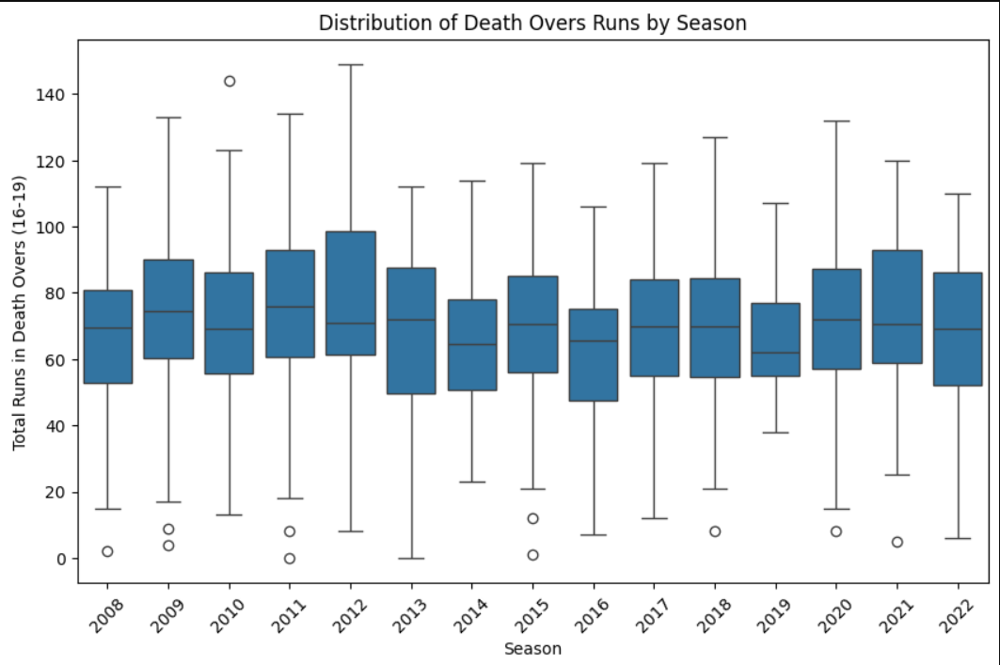
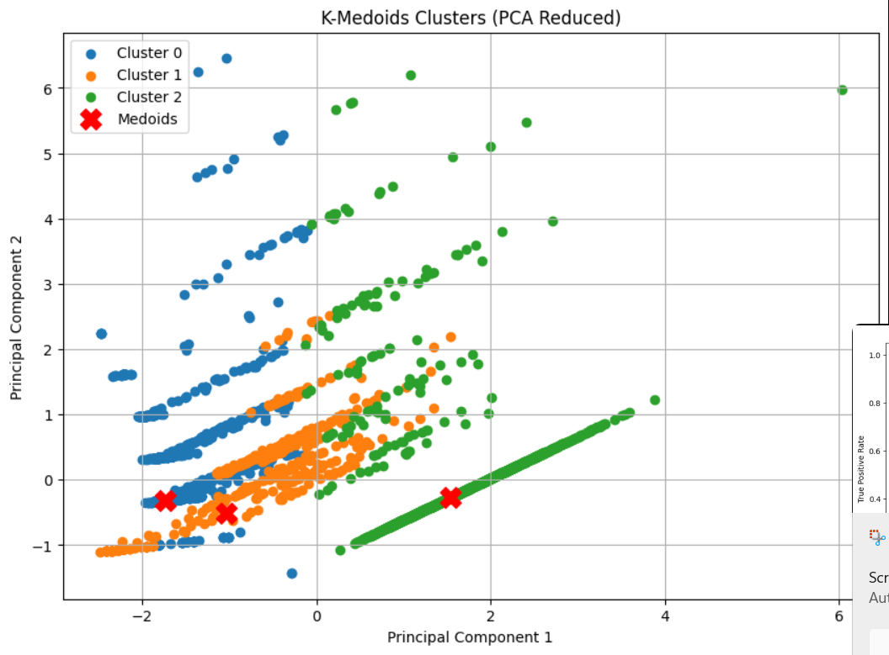

# 🏏 IPL Data Analysis & Prediction Using Machine Learning  

## 📌 Overview  
This project performs **IPL data analysis and predictive modeling** using **Machine Learning** techniques. It extracts insights on player performance, match outcomes, and team strategies through **descriptive, predictive, and clustering-based analytics**.  

  

## 🚀 Features  
- **Descriptive Analysis**: Summarizing team and player performances using visualization techniques.  
- **Predictive Analysis**: Forecasting match outcomes and player success using machine learning models.  
- **Clustering & Classification**: Grouping player performances and match characteristics using ML algorithms.  
- **Data Processing**: Utilizing PySpark and Pandas for efficient handling of large IPL datasets.  

## 🛠️ Technologies Used  
- **Python (Pandas, NumPy, Matplotlib, Seaborn, Scikit-Learn, PySpark)**  
- **Machine Learning (Decision Trees, XGBoost, Naive Bayes, Clustering Algorithms)**  
- **Data Visualization (Matplotlib, Seaborn, Heatmaps, Box Plots, Radar Charts, Pareto Charts, etc.)**  
- **Big Data (Apache Spark, HDFS, MapReduce)**  

## 📊 Data Analysis & Algorithms  
### 1️⃣ Descriptive Analysis  
- **Average result margins per season**  
- **Top-performing players by awards and stats**  
- **Batsman rankings by total career runs**  

  

### 2️⃣ Predictive Modeling  
- **Frequent Itemset Mining (Apriori Algorithm)**  
- **Team winning chances prediction based on toss results**  
- **IPL match prediction using classification models**  

  

### 3️⃣ Machine Learning Models Used  
- **Decision Tree Classification**  
- **Naïve Bayes Classification**  
- **XGBoost Classifier**  
- **OPTICS Clustering for performance-based grouping**  
- **FP-Growth Algorithm for association rule mining**  

## 📂 Project Structure  
```
📝 IPL-Analysis  
├── 📂 data/            # IPL dataset  
├── 📂 images/          # Visualization images  
├── 📂 models/          # Machine learning models  
├── 📜 README.md        # Project documentation  
├── 📜 analysis.ipynb   # Jupyter Notebook for analysis  
└── 📜 requirements.txt # Dependencies  
```

## 🎯 How to Run  
1. Clone the repository:  
   ```bash
   git clone https://github.com/yourusername/IPL-Analysis.git
   cd IPL-Analysis
   ```
2. Install dependencies:  
   ```bash
   pip install -r requirements.txt
   ```
3. Run the Jupyter Notebook:  
   ```bash
   jupyter notebook analysis.ipynb
   ```
   
## 📌 Results & Insights  
- **CSK has the highest IPL win percentage** 📈  
- **Virat Kohli leads the all-time run charts** 🏏  
- **Toss decisions significantly impact match outcomes in some seasons** 🎲  
- **Clustering techniques reveal top performers based on wickets & runs** 🤖  

## 🐟 License  
This project is for **educational purposes only** .  
